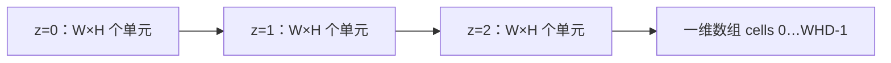
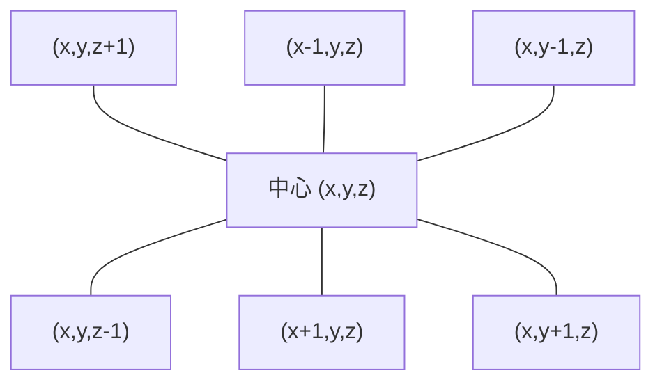
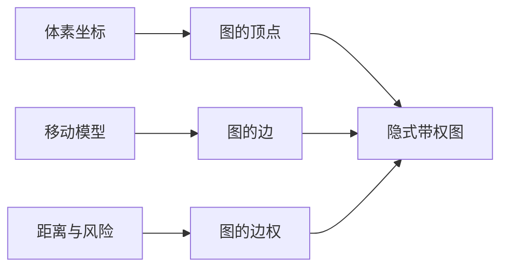
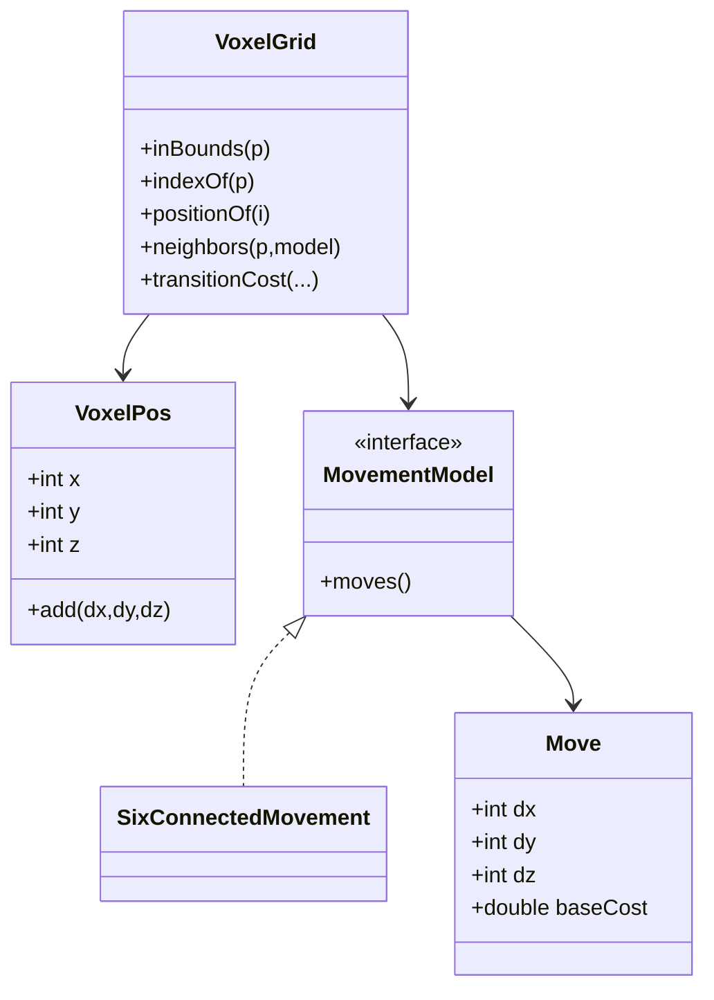
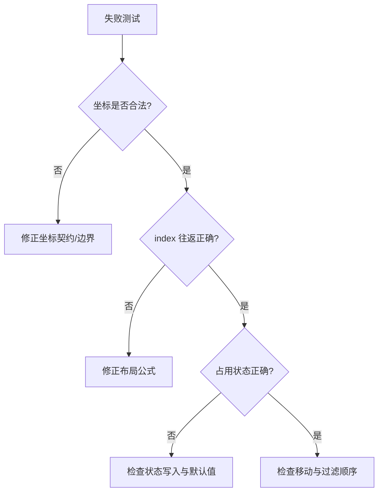
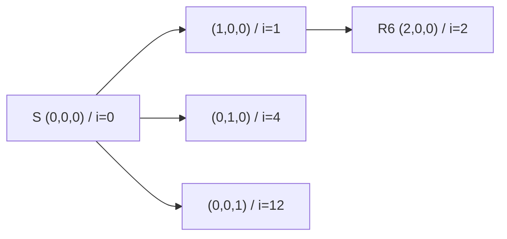
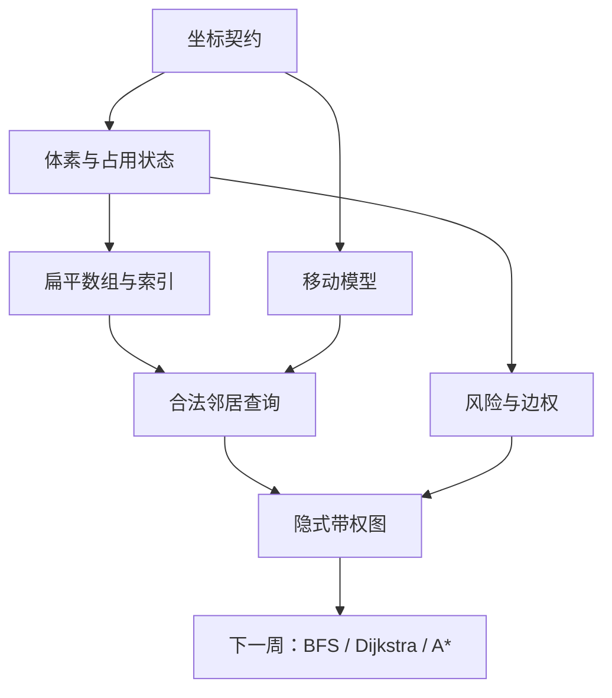

# 第 1 周教材：空间建模——从三维世界到带权图

> **课程方向**：Dynamic Risk-Aware Path Planning in Mutable Voxel Environments  
> **适用对象**：Grade 11 / A-Level Year 12；具备 Python 基础和少量 Java 基础  
> **建议学习时间**：7–9 小时  
> **对应核心知识节点**：K1 坐标与体素、K2 三维扁平索引、K3 邻域与图建模  
> **实现环境**：Java 21、Maven、JUnit 5  
> **教材版本**：2026-09-04

---

## 本章导航

1. [为什么路径规划要从空间建模开始](#1-为什么路径规划要从空间建模开始)
2. [体素、占用状态与分辨率](#2-体素占用状态与分辨率)
3. [坐标契约：让每个数字只有一种解释](#3-坐标契约让每个数字只有一种解释)
4. [三维数据如何进入一维内存](#4-三维数据如何进入一维内存)
5. [六连通邻域与移动模型](#5-六连通邻域与移动模型)
6. [从体素网格到带权图](#6-从体素网格到带权图)
7. [构建最小 VoxelGrid](#7-构建最小-voxelgrid)
8. [用测试证明空间模型正确](#8-用测试证明空间模型正确)
9. [完整案例：4×3×2 动态体素世界](#9-完整案例432-动态体素世界)
10. [本章小结与术语](#10-本章小结)
11. [分层练习与参考解答](#11-exercises)
12. [Programming Lab 与验收条件](#12-programming-lab构建可自证正确的-voxelgrid)
13. [学习路径与参考资料](#13-推荐学习路径与参考资料)

---

## 学习目标

完成本章后，你应当能够：

- 区分连续世界坐标与离散体素坐标；
- 解释 `FREE`、`BLOCKED`、`UNKNOWN` 为什么不能简化成一个 `boolean`；
- 写出一份无歧义的坐标契约；
- 推导并使用三维扁平索引
  $$
  index(x,y,z)=x+W(y+Hz);
  $$
- 从索引反向恢复 `(x,y,z)`；
- 生成六连通邻居，并按“边界→占用状态”安全过滤；
- 把体素、移动和风险分别映射为图的顶点、边与权值；
- 用 Java 21 实现一个最小 `VoxelGrid`；
- 用 JUnit 5 的示例测试、边界测试和性质测试证明实现正确。

本章不要求你实现 Dijkstra、A* 或动态增量规划器。搜索算法只有在空间模型可信之后才值得实现。

---

# 1. 为什么路径规划要从空间建模开始

设想一台无人机需要穿过一座仓库：货架是障碍，局部区域可能有高温或烟雾，某些位置暂时没有传感器观测。人看到的是一个三维场景；计算机需要的是一组可以存储、比较和查询的状态。

路径规划首先要回答的不是“用 A* 还是 Dijkstra”，而是下面四个问题：

1. 哪些位置可以成为路径中的一个状态？
2. 从一个状态可以移动到哪些状态？
3. 一步移动需要付出什么成本？
4. 地图变化时，哪些数据需要被更新？

如果这四个问题没有明确定义，再正确的搜索算法也只会在错误的世界里找到一条“正确路径”。


## 1.1 模型、算法与实现是三层不同的问题

在调试路径规划系统时，必须区分三类错误。

| 层次 | 要回答的问题 | 典型错误 |
|---|---|---|
| 模型 | 世界被怎样离散？什么叫可走？ | y/z 轴交换；`UNKNOWN` 被当作安全区域 |
| 算法 | 如何在图上寻找路径？ | 松弛错误；启发式高估 |
| 实现 | 代码是否忠实执行模型和算法？ | 数组越界；优先队列比较器错误 |

本周只集中解决第一层，并为后两层提供稳定接口。

> **检查你的理解**  
> 如果一条路径穿过墙壁，能否立刻断定 A* 写错了？  
> 不能。应先独立检查坐标、索引、阻塞状态和邻居生成。墙壁可能根本没有被正确编码进图。

## 1.2 为什么使用体素

二维图像由像素组成。类似地，三维空间可以分成许多小立方单元，每个单元叫作 **voxel（体素）**。体素不必真的在内存中保存一个立方体对象；它本质上是由整数坐标定位的一份状态数据。

体素模型的优点：

- 坐标、邻接和数组存储容易定义；
- 可以直接标记占用、风险和更新时间；
- 适合规则空间中的图搜索；
- 地图局部变化时可以只更新受影响的单元。

体素模型的代价：

- 分辨率越细，单元数量按三次方增长；
- 曲面和斜线会被格子近似；
- 机器人有真实体积，不能永远当成一个数学点；
- 规则网格可能包含大量不需要搜索的空单元。

后续研究可以比较稠密体素数组、稀疏哈希体素和 Octree；本周先使用最容易验证的规则稠密网格。

---

# 2. 体素、占用状态与分辨率

## 2.1 一个体素应当保存什么

路径规划至少需要知道一个体素是否可通行。动态风险项目还需要风险和版本信息。概念上，一个体素可以包含：

| 字段 | 示例 | 作用 |
|---|---|---|
| 离散坐标 | `(3,2,1)` | 唯一定位单元 |
| 占用状态 | `FREE` | 决定能否进入 |
| 风险值 | `2.5` | 影响路径代价 |
| 更新时间/版本 | `version=17` | 判断状态属于哪个世界版本 |

但这并不意味着每个体素都要创建一个 Java 对象。后面会看到：坐标可以由索引恢复，占用和风险可以分别放进紧凑数组中。

## 2.2 为什么占用状态不是 boolean

最简单的设计是 `true=blocked`、`false=free`。这个设计丢失了一个重要事实：**没有观测到障碍，不等于已经确认安全**。

本教材使用三个状态：

```java
public enum Occupancy {
    FREE,
    BLOCKED,
    UNKNOWN
}
```

- `FREE`：已有足够证据认为可通行；
- `BLOCKED`：已知不可进入；
- `UNKNOWN`：尚无可靠观测。

如何处理 `UNKNOWN` 是一个项目策略，而不是语言事实：

- 保守策略：不允许进入；
- 探索策略：允许进入，但增加较大风险或信息代价；
- 分阶段策略：正常规划禁止进入，探索任务才允许进入。

关键不在于哪种策略“永远正确”，而在于策略必须被写进配置、测试和实验说明。

> **科研连接：占用概率不等于风险**  
> 一个体素被占用的概率描述地图不确定性；风险可能描述碰撞损失、温度暴露或任务失败代价。二者可以相关，但不能在没有模型的情况下直接当作同一个数。

## 2.3 分辨率决定规模

设空间物理尺寸为 $L_x\times L_y\times L_z$，体素边长为 $r$。三个轴上的单元数可以定义为：

$$
W=\left\lceil\frac{L_x}{r}\right\rceil,
\qquad
H=\left\lceil\frac{L_y}{r}\right\rceil,
\qquad
D=\left\lceil\frac{L_z}{r}\right\rceil.
$$

总体素数为：

$$
N=WHD.
$$

对一个 $10m\times8m\times3m$ 的空间：

| 分辨率 $r$ |     网格尺寸 |    体素数 |
| --------: | -------: | -----: |
|       1 m |   10×8×3 |    240 |
|     0.5 m |  20×16×6 |  1,920 |
|    0.25 m | 40×32×12 | 15,360 |

当 `r` 减半时，每个轴的单元数大约翻倍，总数约变为 $2^3=8$ 倍。若每个体素的搜索状态也增加，内存和运行时间会同时上升。

### 2.3.1 分辨率不是越细越好

更细分辨率可以描述更窄通道，却带来更大的图。合理的 `r` 取决于：

- 机器人尺寸和最小安全间隙；
- 传感器精度；
- 地图总体积；
- 允许的内存和规划延迟；
- 研究问题是否需要观察局部细节。

分辨率属于实验条件。比较算法时，不能让一个算法使用 1m 网格，另一个使用 0.25m 网格，然后把差异全部归因于算法。

## 2.4 机器人不是一个点：障碍膨胀

即使一串体素中心都没有被占用，真实机器人也可能因宽度、旋转半径或定位误差碰到障碍。一种常见做法是按机器人半径和安全裕度扩大障碍区域，再让机器人中心沿剩余空闲体素移动。


本周不实现三维形态学膨胀，但必须知道：`FREE` 的含义应当与机器人几何约束一致。

### 交互观察任务

打开 [OctoMap：3D Occupancy Mapping](https://octomap.github.io/) 与 [OctoMap Documentation](https://octomap.github.io/octomap/doc/)，只回答三个问题：

1. 为什么真实三维地图要区分 occupied、free 和 unknown？
2. 为什么多分辨率结构有助于节省空间？
3. OctoMap 解决的是地图表示问题，还是已经替你解决了动态风险路径规划？

第三题的答案是前者。地图表示是规划系统的输入基础，但不是完整规划器。

### 章节检查 2

1. `UNKNOWN` 和 `FREE` 的证据含义有什么不同？
2. 分辨率从 0.5m 改为 0.25m，总体素数大约变成几倍？
3. 为什么机器人直径 0.6m 时，不能只看体素中心是否空闲？

<details>
<summary>参考答案</summary>

1. `FREE` 表示已有证据确认可通行；`UNKNOWN` 表示尚无可靠观测。
2. 每轴约翻倍，三维总数约 8 倍。
3. 机器人有体积和安全裕度，中心线不碰障碍不代表实体不碰障碍；需要膨胀障碍或做几何碰撞检测。

</details>

---

# 3. 坐标契约：让每个数字只有一种解释

坐标看似简单，却是空间软件中最容易产生“安静错误”的地方。安静错误不会立刻抛出异常，程序甚至可能生成一条路径，只是路径被旋转、翻转或偏移了。

## 3.1 一份坐标契约至少包含五项

1. `x`、`y`、`z` 的正方向；
2. 原点在世界中的位置；
3. 单位是体素格还是米；
4. 坐标代表单元中心还是角点；
5. 合法边界使用什么区间。

本教材采用：

- 离散格坐标 $(x,y,z)\in\mathbb Z^3$；
- 网格尺寸 $W\times H\times D$；
- x 轴长度为 `W`，y 轴长度为 `H`，z 轴长度为 `D`；
- 原点体素为 `(0,0,0)`；
- 合法域为左闭右开区间：
  $$
  0\le x<W,
  \quad 0\le y<H,
  \quad 0\le z<D.
  $$

因此，最大合法坐标是 `(W-1,H-1,D-1)`，而不是 `(W,H,D)`。

## 3.2 世界坐标与格坐标

设网格世界原点为 $(X_0,Y_0,Z_0)$，体素边长为 $r$。从世界坐标到格坐标可使用：

$$
x=\left\lfloor\frac{X-X_0}{r}\right\rfloor,
\quad
y=\left\lfloor\frac{Y-Y_0}{r}\right\rfloor,
\quad
z=\left\lfloor\frac{Z-Z_0}{r}\right\rfloor.
$$

格坐标 `(x,y,z)` 对应的体素中心为：

$$
X_c=X_0+(x+0.5)r,
\quad
Y_c=Y_0+(y+0.5)r,
\quad
Z_c=Z_0+(z+0.5)r.
$$

### 例 3.1：世界坐标落在哪个体素

若世界原点为 `(0,0,0)m`，`r=0.5m`，点 `(1.36,0.74,0.10)m` 对应：

$$
x=\lfloor1.36/0.5\rfloor=2,
\quad y=1,
\quad z=0.
$$

因此它落在体素 `(2,1,0)`。该体素中心是 `(1.25,0.75,0.25)m`。

> **边界提醒**  
> 世界坐标恰好落在体素分界面时，`floor` 会把它分配到右侧/上侧的新单元。浮点误差可能使理论上的边界点稍微偏向一侧。正式系统应规定容差、输入范围和边界策略，并用测试覆盖。

## 3.3 用值对象表示坐标

Java 21 的 `record` 很适合表示不可变的坐标值：

```java
package org.voxelpath.model;

public record VoxelPos(int x, int y, int z) {
    public VoxelPos add(int dx, int dy, int dz) {
        return new VoxelPos(x + dx, y + dy, z + dz);
    }
}
```

这个设计有三个重要性质：

- `VoxelPos` 创建后坐标不变；
- `equals` 和 `hashCode` 按三个分量的值生成；
- 坐标运算返回新对象，避免某个集合中的 key 被悄悄修改。

`record` 只保证其分量引用本身不能重新赋值。如果分量是可变数组，数组内容仍能改变。这里三个分量都是 `int`，因此 `VoxelPos` 具有真正简单的值语义。

## 3.4 坐标轴转换必须显式

不同系统可能使用不同约定，例如：

- 机器人地图：z-up；
- 某些图形系统：y-up；
- 图像数组：第一维可能向下增长；
- 文件格式：坐标顺序可能是 `(z,y,x)`。

不要在多个地方偷偷交换轴。应建立一个明确转换函数，并为它写往返测试：

```java
VoxelPos sensorToGrid(SensorPoint p) { /* one explicit conversion */ }
SensorPoint gridToSensor(VoxelPos p) { /* inverse conversion */ }
```

### 动画观察任务

观看 [Khan Academy：Representing points in 3D](https://www.khanacademy.org/math/multivariable-calculus/thinking-about-multivariable-function/visualizing-scalar-valued-functions/v/representing-points-in-3d)。暂停视频后自行回答：只改变 z 坐标时，点沿哪条轴移动？如果显示系统把 y 当作竖直方向，而输入把 z 当作竖直方向，需要在哪一层转换？

### 章节检查 3

给定 `W=4,H=3,D=2`：

1. `(3,2,1)` 是否合法？
2. `(4,2,1)` 为什么非法？
3. `(0,-1,0)` 为什么必须在数组访问前拒绝？
4. 世界原点 `(10,20,0)m`、`r=2m` 时，格坐标 `(1,2,0)` 的中心世界坐标是多少？

<details>
<summary>参考答案</summary>

1. 合法，它是最大合法坐标。
2. x 必须小于 W；4 已越过 x 方向上界。
3. 负下标无法表示合法数组元素，且如果先计算/访问会抛出越界异常。
4. `(13,25,1)m`。

</details>

---

# 4. 三维数据如何进入一维内存

## 4.1 为什么使用扁平数组

最直观的写法可能是 `Occupancy[][][] cells`。但 Java 多维数组实际上是“数组的数组”，每层包含对其他数组的引用。对规则网格，单个扁平数组通常有以下优势：

- 只需要一次下标访问；
- 数据布局更紧凑；
- 顺序访问时更容易利用 CPU 缓存局部性；
- 可以用一个整数作为统一 ID；
- 占用、风险和搜索状态可以使用相同索引放在多个并行数组中。

概念布局如下：



本教材采用 **x-fastest, y-next, z-slowest**：x 每增加 1，数组索引也增加 1。

## 4.2 推导扁平索引

要定位 `(x,y,z)`：

1. 每个完整 z 层有 $WH$ 个单元，跨过 z 层需要 $WHz$；
2. 每行有 W 个单元，跨过 y 行需要 $Wy$；
3. 在当前行内再移动 x 个位置。

因此：

$$
\begin{aligned}
i &= WHz + Wy + x\\
  &= x+W(y+Hz).
\end{aligned}
$$

### 例 4.1：计算索引

在 `W=5,H=4,D=3` 的网格中：

$$
index(3,2,1)=3+5(2+4\times1)=33.
$$

最大合法点 `(4,3,2)` 的索引为：

$$
4+5(3+4\times2)=59=5\times4\times3-1.
$$

这是一个很有价值的边界检查：最后一个合法坐标必须映射到 `WHD-1`。

## 4.3 从索引恢复坐标

设 `i` 是合法索引：

$$
x=i\bmod W.
$$

去掉 x 方向后：

$$
q=\left\lfloor\frac{i}{W}\right\rfloor.
$$

然后：

$$
y=q\bmod H,
\qquad
z=\left\lfloor\frac{q}{H}\right\rfloor.
$$

对 `i=33,W=5,H=4`：

- `x=33 mod 5=3`；
- `q=33/5=6`（整数除法）；
- `y=6 mod 4=2`；
- `z=6/4=1`。

恢复为 `(3,2,1)`。

## 4.4 索引函数的契约

```java
public int indexOf(VoxelPos p) {
    if (!inBounds(p)) {
        throw new IndexOutOfBoundsException("Out of bounds: " + p);
    }
    return p.x() + width * (p.y() + height * p.z());
}
```

这段代码适用于已经确认 `width*height*depth` 不会超过 `int` 上限的网格。构造网格时应先用 `long` 检查容量：

```java
long cellCount = (long) width * height * depth;
if (cellCount > Integer.MAX_VALUE) {
    throw new IllegalArgumentException("Grid is too large: " + cellCount);
}
```

如果直接用 `int` 相乘，超大尺寸可能先溢出为负数或错误的小数，再导致难以解释的数组行为。

## 4.5 并行数组与空间局部性

一个研究原型可以使用：

```java
private final byte[] occupancy;
private final double[] risk;
```

相同索引 `i` 在两个数组中表示同一个体素的不同属性。这叫作按属性分开的布局。它的优点是：只扫描占用状态时，不必同时读取所有风险值和对象元数据。

例如，邻居过滤主要访问 `occupancy[i]`；计算风险路径成本时再访问 `risk[i]`。连续的 x 方向单元拥有连续索引，顺序遍历更容易命中相邻缓存行。

这一点不是要求 Grade 11 学生掌握处理器微架构，而是建立一个工程直觉：**数据结构不仅影响代码写法，也影响内存占用和访问模式。**

## 4.6 索引正确性的核心性质

对每个合法点 `p`，应满足：

$$
decode(index(p))=p.
$$

对每个合法索引 `i`，应满足：

$$
index(decode(i))=i.
$$

这两条叫作 **round-trip properties（往返性质）**。它们比“测试 `(3,2,1)` 得到 33”更强，因为能够覆盖整个小网格。

### 章节检查 4

给定 `W=6,H=5,D=4`：

1. `(2,3,1)` 的索引是多少？
2. `i=50` 对应哪个坐标？
3. 为什么 `index(W-1,H-1,D-1)` 必须等于 `WHD-1`？
4. 如果把公式错误写成 `z + D(y + Hx)`，它反映了怎样不同的存储顺序？

<details>
<summary>参考答案</summary>

1. `2 + 6*(3 + 5*1) = 50`。
2. `x=50 mod 6=2`，`q=8`，`y=8 mod 5=3`，`z=8/5=1`，所以是 `(2,3,1)`。
3. 前面共有 `WHD-1` 个元素，最后一个元素的零基索引就是 `WHD-1`。
4. 它把 z 作为变化最快的维度，且需要重新检查各维乘数是否与实际数组布局一致。

</details>

---

# 5. 六连通邻域与移动模型

在图搜索中，一个状态的 **neighbors** 决定从这里下一步可以去哪里。三维网格有多种常见邻接规则：

| 邻接方式 | 最大邻居数 | 允许的移动 |
|---|---:|---|
| 6-connected | 6 | 一次只沿一个轴移动 |
| 18-connected | 18 | 允许跨两个轴的面对角移动 |
| 26-connected | 26 | 还允许立方体体对角移动 |

本项目默认使用 6-connected。这样做不是因为 6-connected 永远最好，而是因为它最容易验证、每步几何意义清晰，并能为后续算法提供统一基线。

## 5.1 六个位移向量

六连通候选位移为：

$$
(1,0,0),(-1,0,0),(0,1,0),(0,-1,0),(0,0,1),(0,0,-1).
$$



候选不等于合法邻居。每个候选还要通过两道检查：

1. 坐标在合法域内；
2. 目标体素按当前策略可通行。

检查顺序非常重要：必须先确认坐标在边界内，再读取数组中的占用状态。

## 5.2 用数据表达方向规则

不要把六个方向写成六段重复的 `if`。将规则保存在一个数组中：

```java
private static final int[][] DIR6 = {
    { 1, 0, 0}, {-1, 0, 0},
    { 0, 1, 0}, { 0,-1, 0},
    { 0, 0, 1}, { 0, 0,-1}
};
```

然后使用统一循环：

```java
public List<VoxelPos> neighbors6(VoxelPos p) {
    requireInBounds(p);
    List<VoxelPos> result = new ArrayList<>(6);

    for (int[] d : DIR6) {
        VoxelPos q = p.add(d[0], d[1], d[2]);
        if (inBounds(q) && isTraversable(q)) {
            result.add(q);
        }
    }
    return List.copyOf(result);
}
```

`List.copyOf` 返回不可修改的结果，避免调用者把网格的邻接结果误当成可编辑内部状态。

## 5.3 不同位置的邻居数量

在没有阻塞体素时：

- 内部点最多有 6 个邻居；
- 面上的非边点最多有 5 个；
- 棱上的非角点最多有 4 个；
- 角点最多有 3 个。

这些数量是很好的测试预言。如果一个空网格角点返回 6 个邻居，你几乎可以确定边界过滤有误。

## 5.4 移动模型应该可替换

研究项目可能以后比较 6/18/26-connected。不要让规划器把六方向常量写死在算法内部。可以定义：

```java
public interface MovementModel {
    List<Move> movesFrom(VoxelPos position);
}

public record Move(int dx, int dy, int dz, double baseCost) {}
```

`SixConnectedMovement` 返回六个轴向 `Move`。网格负责判断目标坐标是否合法和可通行；移动模型负责声明允许哪些相对移动及基础成本。

这种分离带来两个好处：

- 同一规划算法可以复用在不同邻接模型上；
- 实验可以把移动模型作为显式控制变量。

## 5.5 对角移动为什么需要不同成本

本周默认 6-connected，每步几何长度为 `r`。若以后允许面对角移动，长度是 $r\sqrt2$；体对角移动长度是 $r\sqrt3$。把所有对角步也设为成本 1，会改变路径的几何含义。

这也是为什么启发式必须和移动模型匹配：六连通常使用 Manhattan 距离；允许对角线时需重新选择合法的距离下界。

### 章节检查 5

1. `3×3×3` 空网格的中心 `(1,1,1)` 有几个六连通邻居？
2. 角点 `(0,0,0)` 有哪些邻居？
3. 如果 `(1,0,0)` 被阻塞，角点还剩几个可走邻居？
4. 为什么 `isTraversable(q) && inBounds(q)` 的顺序可能不安全？

<details>
<summary>参考答案</summary>

1. 6 个。
2. `(1,0,0)`、`(0,1,0)`、`(0,0,1)`。
3. 2 个。
4. `isTraversable` 可能先把越界坐标转换成数组索引并访问数组；应先 `inBounds`。

</details>

---
# 6. 从体素网格到带权图

## 6.1 图是空间模型与搜索算法之间的接口

图由顶点和边组成。在体素路径规划中，最自然的映射是：

| 体素世界概念 | 图论概念 |
|---|---|
| 可通行体素 | 顶点 $v\in V$ |
| 从一个体素到另一个体素的合法移动 | 边 $(u,v)\in E$ |
| 移动距离、能耗或风险 | 边权 $w(u,v)$ |
| 起始体素 | 起点 $s$ |
| 目标体素 | 终点 $g$ |



搜索算法不需要知道一个顶点在屏幕上画成什么立方体。它只需要能够：

1. 判断起点和目标是否有效；
2. 查询一个顶点的邻居；
3. 查询移动到邻居的成本。

这正是 `VoxelGrid` 应向搜索算法提供的接口。

## 6.2 显式图与隐式图

**显式图**会提前保存所有顶点和每条边。对于规则体素网格，这通常没有必要。六连通边可以由坐标和移动规则即时计算，因此更适合使用 **隐式图**：

- 体素状态保存在数组中；
- 请求 `neighbors(p)` 时现场生成候选；
- 通过边界和占用状态过滤；
- 请求 `cost(p,q)` 时根据距离和风险计算。

假设有一百万个可通行体素。显式保存每个体素最多六条边会产生数百万条边记录；隐式表示只保存地图状态和固定的六个移动向量。

动态环境中，隐式表示还有一个优势：某个体素变为阻塞时，不需要在多个邻接表中搜索并删除所有相关边。邻居查询会自然读取最新快照的状态。

## 6.3 阻塞体素应如何进入图

常见方案有三种：

1. 删除阻塞顶点；
2. 保留顶点但删除所有进入/离开它的边；
3. 保留边并赋无穷大成本。

本教材采用第二种的隐式等价形式：占用数组仍保存阻塞体素，但 `neighbors` 不返回它，因此搜索图中不存在可走入该体素的边。

这样做比使用一个非常大的有限数更安全。`1_000_000` 不是数学上的无穷大；在足够大的地图中，它可能仍被算法当成可走路径的一部分。

## 6.4 边权是一份数学契约

六连通、等分辨率时，每个轴向移动的基础成本可以设为 1。若进入目标体素 `v` 时承受风险，可定义：

$$
w(u,v)=c_{move}(u,v)+\lambda\,risk(v).
$$

本项目的入门约定是：

- `risk(v) >= 0`；
- `lambda >= 0`；
- 风险在“进入目标体素”时计算；
- 起点风险不自动计入；
- 终点风险在进入终点时计入一次；
- 阻塞体素不产生可走边。

如果 `risk(u) != risk(v)`，则：

$$
w(u,v)\ne w(v,u)
$$

可能成立。因此，即使几何移动双向可行，风险加权图也可以视为有向带权图。

> **为什么要求非负？**  
> 后续 Dijkstra 和常见 A* 正确性保证依赖非负边权。若你把“奖励”设计成负风险，必须重新分析算法前提；不能只改一个数值范围。

## 6.5 距离成本应保留物理单位

若体素边长为 `r` 米，可以将轴向移动基础成本设为 `r`，而不是总设为 1。这样 `C(P)` 具有米的含义。若为了教学把每步设为 1，应明确它表示“步数单位”。

当距离和风险相加时，`lambda` 的作用是把一单位风险转换成等价距离成本。因此公式中每个量的单位必须在实验报告中说明。

## 6.6 图模型的不变量

在开始搜索前，教师或学生应能逐条验证：

- 每个顶点对应一个合法、按策略可通行的体素；
- 每条边对应移动模型允许的一步；
- 边的终点没有越界，也没有被阻塞；
- 所有边权是有限非负数；
- 相同快照和相同参数产生相同邻居与成本；
- 路径中的相邻坐标都能在图中找到对应边。

### 交互观察任务

打开 [Red Blob Games：Grids and Graphs](https://www.redblobgames.com/pathfinding/grids/graphs.html)，切换页面中的 grid/graph 显示，并回答：

1. 为什么同一张图可以画成不同布局？
2. 障碍位于格子内部时，删除顶点和删除进入该格子的边有何关系？
3. 为什么边权能表达“道路、森林、水域”等不同移动成本？

该页面展示二维网格，但“格子→顶点、邻接→边”的抽象可以直接扩展到三维体素。

### 章节检查 6

1. 体素网格为什么不必预先保存所有边？
2. 若风险记在目标体素上，为什么同一对相邻体素的两个方向可能成本不同？
3. 阻塞体素使用一个极大有限权值有什么风险？
4. 若基础移动成本和风险都非负，组合边权是否可能为负？

<details>
<summary>参考答案</summary>

1. 规则移动可以由当前位置和固定移动向量即时生成，使用隐式图更节省边存储。
2. `u→v` 加 `risk(v)`，`v→u` 加 `risk(u)`；二者风险可能不同。
3. 该数仍是有限成本，长路径或其他参数条件下可能被当作合法路线；也容易引发溢出。
4. 在 `lambda>=0` 时不会。

</details>

---

# 7. 构建最小 VoxelGrid

这一节把前面的数学契约翻译成 Java。代码的目标不是追求所有优化，而是让每一条规则都有明确位置和测试入口。

## 7.1 建议的包结构

```text
src/
├── main/java/org/voxelpath/model/
│   ├── Occupancy.java
│   ├── VoxelPos.java
│   ├── Move.java
│   ├── MovementModel.java
│   ├── SixConnectedMovement.java
│   └── VoxelGrid.java
└── test/java/org/voxelpath/model/
    └── VoxelGridTest.java
```

模型代码不依赖搜索算法。将来 Dijkstra、A* 和增量规划器都可以调用同一个 `VoxelGrid` 接口。

## 7.2 基础类型

### `Occupancy.java`

```java
package org.voxelpath.model;

public enum Occupancy {
    FREE,
    BLOCKED,
    UNKNOWN
}
```

### `VoxelPos.java`

```java
package org.voxelpath.model;

public record VoxelPos(int x, int y, int z) {
    public VoxelPos add(int dx, int dy, int dz) {
        return new VoxelPos(x + dx, y + dy, z + dz);
    }
}
```

### `Move.java`

```java
package org.voxelpath.model;

public record Move(int dx, int dy, int dz, double baseCost) {
    public Move {
        if (!Double.isFinite(baseCost) || baseCost <= 0.0) {
            throw new IllegalArgumentException(
                    "baseCost must be positive and finite");
        }
    }

    public VoxelPos applyTo(VoxelPos p) {
        return p.add(dx, dy, dz);
    }
}
```

## 7.3 可替换移动模型

```java
package org.voxelpath.model;

import java.util.List;

public interface MovementModel {
    List<Move> moves();
}
```

```java
package org.voxelpath.model;

import java.util.List;

public final class SixConnectedMovement implements MovementModel {
    private final List<Move> moves;

    public SixConnectedMovement(double axialCost) {
        moves = List.of(
                new Move( 1, 0, 0, axialCost),
                new Move(-1, 0, 0, axialCost),
                new Move( 0, 1, 0, axialCost),
                new Move( 0,-1, 0, axialCost),
                new Move( 0, 0, 1, axialCost),
                new Move( 0, 0,-1, axialCost));
    }

    @Override
    public List<Move> moves() {
        return moves;
    }
}
```

`axialCost` 可以设为 1（步数单位），也可以设为体素分辨率 `r`（米）。移动模型只声明动作；网格决定动作落点是否有效。

## 7.4 `VoxelGrid` 的数据和构造器

```java
package org.voxelpath.model;

import java.util.ArrayList;
import java.util.Arrays;
import java.util.List;
import java.util.Objects;

public final class VoxelGrid {
    private final int width;
    private final int height;
    private final int depth;
    private final double resolutionMetres;
    private final Occupancy[] occupancy;
    private final double[] risk;

    public VoxelGrid(
            int width,
            int height,
            int depth,
            double resolutionMetres) {

        if (width <= 0 || height <= 0 || depth <= 0) {
            throw new IllegalArgumentException(
                    "Grid dimensions must be positive");
        }
        if (!Double.isFinite(resolutionMetres)
                || resolutionMetres <= 0.0) {
            throw new IllegalArgumentException(
                    "Resolution must be positive and finite");
        }

        long cellCount = (long) width * height * depth;
        if (cellCount > Integer.MAX_VALUE) {
            throw new IllegalArgumentException(
                    "Grid is too large: " + cellCount);
        }

        this.width = width;
        this.height = height;
        this.depth = depth;
        this.resolutionMetres = resolutionMetres;
        this.occupancy = new Occupancy[(int) cellCount];
        this.risk = new double[(int) cellCount];

        Arrays.fill(occupancy, Occupancy.UNKNOWN);
    }
```

默认填充 `UNKNOWN` 比默认 `FREE` 更安全。新创建的地图没有自动获得“全部空间安全”的证据。

## 7.5 边界、索引和解码

将下面方法放入 `VoxelGrid`：

```java
    public int width() { return width; }
    public int height() { return height; }
    public int depth() { return depth; }
    public double resolutionMetres() { return resolutionMetres; }
    public int cellCount() { return occupancy.length; }

    public boolean inBounds(VoxelPos p) {
        Objects.requireNonNull(p, "position");
        return 0 <= p.x() && p.x() < width
                && 0 <= p.y() && p.y() < height
                && 0 <= p.z() && p.z() < depth;
    }

    public int indexOf(VoxelPos p) {
        requireInBounds(p);
        return p.x() + width * (p.y() + height * p.z());
    }

    public VoxelPos positionOf(int index) {
        if (index < 0 || index >= cellCount()) {
            throw new IndexOutOfBoundsException(
                    "Invalid index: " + index);
        }
        int x = index % width;
        int q = index / width;
        int y = q % height;
        int z = q / height;
        return new VoxelPos(x, y, z);
    }

    private void requireInBounds(VoxelPos p) {
        if (!inBounds(p)) {
            throw new IndexOutOfBoundsException(
                    "Out of bounds: " + p);
        }
    }
```

请注意方法职责：

- `inBounds` 是不会抛越界异常的询问；
- `indexOf` 要访问数据，因此非法输入立即失败；
- `positionOf` 只接受 `[0,cellCount)` 中的索引；
- 所有数组访问都通过同一索引函数，避免公式散落。

## 7.6 占用与风险访问

```java
    public Occupancy occupancyAt(VoxelPos p) {
        return occupancy[indexOf(p)];
    }

    public void setOccupancy(VoxelPos p, Occupancy value) {
        occupancy[indexOf(p)] =
                Objects.requireNonNull(value, "occupancy");
    }

    public void fillOccupancy(Occupancy value) {
        Arrays.fill(
                occupancy,
                Objects.requireNonNull(value, "occupancy"));
    }

    public double riskAt(VoxelPos p) {
        return risk[indexOf(p)];
    }

    public void setRisk(VoxelPos p, double value) {
        if (!Double.isFinite(value) || value < 0.0) {
            throw new IllegalArgumentException(
                    "Risk must be non-negative and finite");
        }
        risk[indexOf(p)] = value;
    }

    public boolean isTraversable(VoxelPos p) {
        return occupancyAt(p) == Occupancy.FREE;
    }
```

本周采用保守策略：只有 `FREE` 可通行。以后如果要允许探索 `UNKNOWN`，应通过策略对象或配置扩展，而不是偷偷改动多个 `if`。

## 7.7 邻居查询

```java
    public List<VoxelPos> neighbors(
            VoxelPos p,
            MovementModel movementModel) {

        requireInBounds(p);
        Objects.requireNonNull(movementModel, "movementModel");
        List<VoxelPos> result = new ArrayList<>(
                movementModel.moves().size());

        for (Move move : movementModel.moves()) {
            VoxelPos q = move.applyTo(p);
            if (inBounds(q) && isTraversable(q)) {
                result.add(q);
            }
        }
        return List.copyOf(result);
    }
```

这个方法没有检查起点 `p` 是否 `FREE`。这是有意的接口决定：查询一个合法坐标周围可走位置，与判断机器人当前状态是否合理是两个不同问题。规划器在开始前仍应验证起点和目标可通行。

## 7.8 边成本

```java
    public double transitionCost(
            VoxelPos destination,
            Move move,
            double lambda) {

        requireInBounds(destination);
        Objects.requireNonNull(move, "move");
        if (!isTraversable(destination)) {
            throw new IllegalArgumentException(
                    "Destination is not traversable: " + destination);
        }
        if (!Double.isFinite(lambda) || lambda < 0.0) {
            throw new IllegalArgumentException(
                    "lambda must be non-negative and finite");
        }
        return move.baseCost() + lambda * riskAt(destination);
    }
}
```

末尾的 `}` 关闭 `VoxelGrid` 类。

该方法只计算“给定 move 进入 destination”的成本。完整规划器还应验证 `move.applyTo(source).equals(destination)`，或在邻接迭代时把 `Move` 和目标位置一起返回，避免调用者传入不匹配的动作。

## 7.9 设计复盘

这个最小实现建立了几个清晰边界：



- 坐标值由 `VoxelPos` 表示；
- 允许的相对动作由 `MovementModel` 表示；
- 状态数组、边界和成本由 `VoxelGrid` 管理；
- 搜索算法以后只依赖这些稳定能力。

### 章节检查 7

1. 为什么构造器默认填充 `UNKNOWN` 而不是 `FREE`？
2. 为什么所有数组访问应集中经过 `indexOf`？
3. 为什么 `MovementModel` 不直接读取网格占用数组？
4. 如果以后切换到 26-connected，哪些类应改变，哪些不应改变？

<details>
<summary>参考答案</summary>

1. 新地图尚无观测证据，默认安全会制造虚假通路。
2. 可以集中保证边界检查和统一布局，避免多个公式版本产生不一致。
3. 移动模型只定义动作规则，网格管理世界状态；分离后更容易替换和测试。
4. 新增/替换 `MovementModel` 实现及相应启发式/成本规则；`VoxelPos`、索引布局和大部分 `VoxelGrid` 不应重写。

</details>

---

# 8. 用测试证明空间模型正确

CS 61B 的测试章节强调：测试不是写完代码后的装饰，而是中高级程序员用于定义和检查行为的核心技能。本项目尤其需要在搜索算法之前建立可信的空间模型测试。

参考阅读：[CS 61B Spring 2026：Testing](https://cs61b-2.gitbook.io/cs61b-textbook-spring-2026/4.-testing)。

## 8.1 测试不只检查“正常例”

本章至少需要五类测试：

| 类型 | 示例 | 想抓住的错误 |
|---|---|---|
| 正常例 | 内部点索引与邻居 | 基本公式/规则错误 |
| 边界例 | `(0,0,0)`、最大合法点 | off-by-one |
| 非法例 | 负坐标、`x==W`、`index==N` | 越界未拒绝 |
| 性质例 | 所有点索引往返 | 只对示例数字有效 |
| 回归例 | 曾经修复的 y/z 交换 | bug 再次出现 |

## 8.2 索引往返测试

```java
package org.voxelpath.model;

import static org.junit.jupiter.api.Assertions.assertEquals;

import org.junit.jupiter.api.Test;

class VoxelGridTest {

    @Test
    void indexRoundTripsEveryPosition() {
        VoxelGrid grid = new VoxelGrid(5, 4, 3, 0.5);

        for (int z = 0; z < grid.depth(); z++) {
            for (int y = 0; y < grid.height(); y++) {
                for (int x = 0; x < grid.width(); x++) {
                    VoxelPos expected = new VoxelPos(x, y, z);
                    int index = grid.indexOf(expected);
                    assertEquals(expected, grid.positionOf(index));
                }
            }
        }
    }
}
```

它检查全部 60 个坐标，而不是只检查一个例子。

## 8.3 边界测试

```java
import static org.junit.jupiter.api.Assertions.assertFalse;
import static org.junit.jupiter.api.Assertions.assertThrows;
import static org.junit.jupiter.api.Assertions.assertTrue;

@Test
void acceptsMaximumLegalCoordinate() {
    VoxelGrid grid = new VoxelGrid(4, 3, 2, 1.0);
    assertTrue(grid.inBounds(new VoxelPos(3, 2, 1)));
}

@Test
void rejectsCoordinateAtWidth() {
    VoxelGrid grid = new VoxelGrid(4, 3, 2, 1.0);
    VoxelPos invalid = new VoxelPos(4, 1, 1);

    assertFalse(grid.inBounds(invalid));
    assertThrows(IndexOutOfBoundsException.class,
            () -> grid.indexOf(invalid));
}

@Test
void rejectsNegativeCoordinate() {
    VoxelGrid grid = new VoxelGrid(4, 3, 2, 1.0);
    assertThrows(IndexOutOfBoundsException.class,
            () -> grid.indexOf(new VoxelPos(-1, 0, 0)));
}
```

## 8.4 邻居测试

```java
import static org.junit.jupiter.api.Assertions.assertEquals;
import static org.junit.jupiter.api.Assertions.assertFalse;

import java.util.Set;

@Test
void emptyGridCornerHasThreeNeighbors() {
    VoxelGrid grid = new VoxelGrid(3, 3, 3, 1.0);
    grid.fillOccupancy(Occupancy.FREE);
    MovementModel model = new SixConnectedMovement(1.0);

    Set<VoxelPos> actual = Set.copyOf(
            grid.neighbors(new VoxelPos(0, 0, 0), model));

    Set<VoxelPos> expected = Set.of(
            new VoxelPos(1, 0, 0),
            new VoxelPos(0, 1, 0),
            new VoxelPos(0, 0, 1));

    assertEquals(expected, actual);
}

@Test
void blockedVoxelIsNotReturnedAsNeighbor() {
    VoxelGrid grid = new VoxelGrid(3, 3, 3, 1.0);
    grid.fillOccupancy(Occupancy.FREE);
    VoxelPos blocked = new VoxelPos(1, 0, 0);
    grid.setOccupancy(blocked, Occupancy.BLOCKED);

    var neighbors = grid.neighbors(
            new VoxelPos(0, 0, 0),
            new SixConnectedMovement(1.0));

    assertFalse(neighbors.contains(blocked));
    assertEquals(2, neighbors.size());
}
```

测试用 `Set` 比较，是因为这一测试关心邻居集合，不关心输出顺序。如果项目希望搜索轨迹完全确定，则可以进一步规定并测试邻居顺序。

## 8.5 成本测试

```java
@Test
void transitionCostIncludesDestinationRisk() {
    VoxelGrid grid = new VoxelGrid(2, 1, 1, 1.0);
    VoxelPos destination = new VoxelPos(1, 0, 0);
    grid.setOccupancy(destination, Occupancy.FREE);
    grid.setRisk(destination, 6.0);
    Move move = new Move(1, 0, 0, 1.0);

    assertEquals(
            4.0,
            grid.transitionCost(destination, move, 0.5),
            1e-12);
}

@Test
void rejectsNegativeRisk() {
    VoxelGrid grid = new VoxelGrid(1, 1, 1, 1.0);
    assertThrows(IllegalArgumentException.class,
            () -> grid.setRisk(new VoxelPos(0, 0, 0), -0.1));
}
```

浮点比较提供一个很小的 tolerance，而不是假设所有浮点运算都能精确相等。

## 8.6 一个强性质：邻居必须满足所有不变量

```java
@Test
void everyReturnedNeighborIsLegalAndAxiallyAdjacent() {
    VoxelGrid grid = new VoxelGrid(4, 3, 2, 1.0);
    grid.fillOccupancy(Occupancy.FREE);
    MovementModel model = new SixConnectedMovement(1.0);

    for (int i = 0; i < grid.cellCount(); i++) {
        VoxelPos p = grid.positionOf(i);
        for (VoxelPos q : grid.neighbors(p, model)) {
            int manhattan = Math.abs(p.x() - q.x())
                    + Math.abs(p.y() - q.y())
                    + Math.abs(p.z() - q.z());

            assertTrue(grid.inBounds(q));
            assertEquals(Occupancy.FREE, grid.occupancyAt(q));
            assertEquals(1, manhattan);
        }
    }
}
```

这条测试不关心某个固定位置，而是检查所有返回边都符合六连通图定义。

## 8.7 测试失败时的调试顺序



不要在 `neighbors` 失败时立刻修改未来的搜索算法。使用最小失败例，把问题限制在 `2×2×1` 或 `3×3×1` 网格中。

### 章节检查 8

1. 为什么测试一个索引例子不如往返性质有力？
2. 为什么邻居集合测试可以忽略顺序，而算法复现实验可能不能忽略顺序？
3. 为什么默认 `UNKNOWN` 会让“忘记初始化 FREE”更快暴露？
4. 回归测试应在什么时候删除？

<details>
<summary>参考答案</summary>

1. 单例只覆盖一个输入，错误公式可能刚好在该输入上得到相同值；往返可覆盖整个小域。
2. 集合语义只关心成员；但相同优先级时，邻居顺序可能影响搜索轨迹和父节点选择，确定性实验需固定顺序。
3. 未初始化区域会不可走，而不是悄悄形成虚假安全通路，错误更明显。
4. 通常不应删除；每个已修复 bug 的最小测试应保留，防止复发。

</details>

---

# 9. 完整案例：4×3×2 动态体素世界

这一节把坐标、索引、邻接和边权放在同一个小场景中。网格尺寸：

$$
W=4,\quad H=3,\quad D=2,
\quad N=24.
$$

图中 `S` 是起点，`G` 是目标，`#` 是阻塞体素，`R6` 是风险值为 6 的可通行体素，`.` 是普通 `FREE`。

## 9.1 两个 z 切片

### z = 0

| y\x | 0 | 1 | 2 | 3 |
|---:|:---:|:---:|:---:|:---:|
| 2 | . | . | # | . |
| 1 | . | # | . | . |
| 0 | S | . | R6 | . |

### z = 1

| y\x | 0 | 1 | 2 | 3 |
|---:|:---:|:---:|:---:|:---:|
| 2 | . | . | . | G |
| 1 | . | # | . | . |
| 0 | . | . | . | . |

坐标定义：

- `S=(0,0,0)`；
- `G=(3,2,1)`；
- 阻塞：`(1,1,0)`、`(2,2,0)`、`(1,1,1)`；
- 高风险但可通行：`(2,0,0)`，风险为 6；
- 其余体素风险为 0。

## 9.2 计算关键索引

使用：

$$
i=x+4(y+3z).
$$

| 体素 | 计算 | 索引 |
|---|---|---:|
| `S=(0,0,0)` | `0+4(0+0)` | 0 |
| `(1,0,0)` | `1+4(0+0)` | 1 |
| `R6=(2,0,0)` | `2+4(0+0)` | 2 |
| `(0,1,0)` | `0+4(1+0)` | 4 |
| `(0,0,1)` | `0+4(0+3)` | 12 |
| `G=(3,2,1)` | `3+4(2+3)` | 23 |

目标恰好是最大合法坐标，因此索引为 `N-1=23`。

## 9.3 起点邻居

`S=(0,0,0)` 的六个候选中，三个为负坐标，被边界过滤；剩余合法邻居是：

- `(1,0,0)`；
- `(0,1,0)`；
- `(0,0,1)`。

它们都为 `FREE`，所以全部保留。



## 9.4 一条边的风险成本

从 `(1,0,0)` 进入 `R6=(2,0,0)`。设轴向基础成本为 1，`lambda=0.5`：

$$
w=1+0.5\times6=4.
$$

从 `R6` 返回 `(1,0,0)` 时，目标体素风险为 0，因此反向成本为 1。这个例子说明风险记在目标体素后，边权可能具有方向性。

## 9.5 手工验证一条候选路径

候选路径：

```text
(0,0,0) → (0,0,1) → (1,0,1) → (2,0,1)
→ (3,0,1) → (3,1,1) → (3,2,1)
```

逐步检查：

1. 每个坐标都在边界内；
2. 每一步只改变一个轴且变化量为 1；
3. 所有目标体素都是 `FREE`；
4. 路径没有进入 `R6`，累计风险为 0；
5. 共有 6 条边，若基础成本为 1，则移动成本为 6。

这就是后续路径验证器应自动完成的工作。搜索算法返回一串坐标后，不能直接相信它；必须重新计算合法性和成本。

## 9.6 场景的 Java 构造

```java
VoxelGrid grid = new VoxelGrid(4, 3, 2, 1.0);
grid.fillOccupancy(Occupancy.FREE);

grid.setOccupancy(new VoxelPos(1, 1, 0), Occupancy.BLOCKED);
grid.setOccupancy(new VoxelPos(2, 2, 0), Occupancy.BLOCKED);
grid.setOccupancy(new VoxelPos(1, 1, 1), Occupancy.BLOCKED);

VoxelPos risky = new VoxelPos(2, 0, 0);
grid.setRisk(risky, 6.0);

VoxelPos start = new VoxelPos(0, 0, 0);
VoxelPos goal = new VoxelPos(3, 2, 1);
MovementModel movement = new SixConnectedMovement(1.0);
```

建议把这个场景放入测试夹具或小型场景文件中。第二周实现搜索算法后，同一输入可以用于 BFS、Dijkstra 和 A* 的对照。

### 章节检查 9

1. `(3,1,1)` 的索引是多少？
2. 阻塞点 `(1,1,0)` 的索引是多少？
3. `R6` 的反向边成本为什么可能不是 4？
4. 如果 `G` 在事件中变为 `BLOCKED`，模型应返回“无合法目标”，还是允许算法进入？

<details>
<summary>参考答案</summary>

1. `3+4*(1+3)=19`。
2. `1+4*(1+0)=5`。
3. 反向移动的目标是 `(1,0,0)`；按“进入目标计风险”的约定，它的风险为 0，成本为 1。
4. 规划开始前应拒绝不可通行目标，返回明确失败状态；不能让算法把阻塞目标当作可进入顶点。

</details>

---

# 10. 本章小结

本周建立了整个动态风险路径规划项目的空间基础。

## 10.1 核心概念

### 体素模型

- 体素是由整数坐标定位的三维空间单元，不必对应一个 Java 对象；
- `FREE`、`BLOCKED`、`UNKNOWN` 表示不同证据状态；
- 分辨率减半时，规则三维网格规模通常约增至 8 倍；
- 机器人有体积，因此需要障碍膨胀或更完整的碰撞模型。

### 坐标契约

- 明确轴、原点、单位、中心/角点和边界；
- 本教材采用：
  $$
  0\le x<W,
  \quad0\le y<H,
  \quad0\le z<D;
  $$
- 外部坐标系转换应集中在显式转换层中。

### 扁平索引

- x-fastest 布局：
  $$
  i=x+W(y+Hz);
  $$
- 解码：
  $$
  x=i\bmod W,
  \quad q=\lfloor i/W\rfloor,
  \quad y=q\bmod H,
  \quad z=\lfloor q/H\rfloor;
  $$
- 关键性质：`positionOf(indexOf(p)).equals(p)`。

### 邻域和图

- 6-connected 一次只沿一个轴移动；
- 候选邻居必须先做边界检查，再读取占用状态；
- 可通行体素映射为顶点，合法移动映射为边，距离和风险映射为边权；
- 规则网格通常使用隐式图，不预存全部边；
- 可走边权必须保持有限且非负，为 Dijkstra/A* 提供前提。

### 测试

- 示例测试说明一个具体行为；
- 边界测试抓住 off-by-one；
- 性质测试检查整个小输入域；
- 回归测试让已修复错误不再出现；
- 搜索算法开始前，`VoxelGrid` 的坐标、索引、邻居和成本测试必须稳定通过。

## 10.2 本章概念图



## 10.3 术语表

| 术语 | 本章含义 |
|---|---|
| Voxel | 离散三维空间单元 |
| Resolution | 一个体素在现实世界中的边长/尺度 |
| Occupancy | 对体素是否可通行的状态描述 |
| Coordinate contract | 对轴、原点、单位和边界的统一约定 |
| Flat index | 将多维坐标映射到一维数组的位置 |
| 6-connected | 只允许沿三个坐标轴正负方向移动的邻接模型 |
| Movement model | 定义允许动作和基础移动成本的策略 |
| Implicit graph | 需要时计算邻居和边，而不是预存全部边的图 |
| Edge weight | 执行一步移动的数值成本 |
| Invariant | 实现过程中必须始终成立的性质 |
| Round-trip test | 编码后解码或解码后编码应恢复原值的测试 |
| Obstacle inflation | 根据机器人尺寸扩大障碍区域 |

---

# 11. Exercises

本节沿用 CS 61B 教材常见的三类练习：

- **Factual**：检查术语和基本事实；
- **Procedural**：完成计算、追踪和代码推理；
- **Metacognitive**：解释设计取舍、证据和局限。

建议先独立完成，再展开答案。只“看懂答案”不算完成。

## 11.1 Factual

### F1

在尺寸为 `W×H×D` 的网格中，最大合法坐标是：

A. `(W,H,D)`  
B. `(W-1,H-1,D-1)`  
C. `(W-1,H,D)`  
D. `(0,0,0)`

### F2

分辨率从 `r` 减半到 `r/2`，固定三维空间的体素数大约：

A. 变为 2 倍  
B. 变为 4 倍  
C. 变为 8 倍  
D. 不变

### F3

`UNKNOWN` 最准确的含义是：

A. 已确认可通行  
B. 已确认阻塞  
C. 尚无可靠观测  
D. 风险一定为零

### F4

六连通移动允许：

A. `(1,1,0)`  
B. `(1,0,0)`  
C. `(1,1,1)`  
D. `(2,0,0)`

### F5

x-fastest 布局的索引公式是：

A. `x + W*(y + H*z)`  
B. `z + D*(y + H*x)`  
C. `x*y*z`  
D. `x + y + z`

### F6

角点 `(0,0,0)` 在一个至少 `2×2×2` 的空六连通网格中最多有：

A. 2 个邻居  
B. 3 个邻居  
C. 6 个邻居  
D. 8 个邻居

### F7

为什么应该先执行 `inBounds(q)`，再读取 `occupancyAt(q)`？

A. 为了让风险变小  
B. 防止越界数组访问  
C. 为了改变移动模型  
D. 为了计算平均数

### F8

在 `w(u,v)=baseCost+lambda*risk(v)` 中，如果所有三项都非负，则边权：

A. 可能为负  
B. 一定非负  
C. 一定等于 1  
D. 与目标体素无关

### F9

规则体素网格使用隐式图的主要含义是：

A. 不存在顶点  
B. 不允许边权  
C. 邻居和边在查询时计算  
D. 只能使用 BFS

### F10

下面哪条测试最有力地验证索引和解码互为逆操作？

A. 只测试 `(0,0,0)`  
B. 只测试最后一个坐标  
C. 对所有合法坐标检查 `decode(index(p))==p`  
D. 只检查数组长度

<details>
<summary>Factual 答案与解释</summary>

1. **B**。零基索引的最后一个位置是每维尺寸减 1。
2. **C**。每轴约乘 2，总数乘 $2^3=8$。
3. **C**。未知不是安全或阻塞的同义词。
4. **B**。六连通一次只改变一个轴一个单位。
5. **A**。本教材采用 x-fastest、y-next、z-slowest。
6. **B**。只有三个正方向候选合法。
7. **B**。占用查询通常需要数组索引，越界坐标必须先被过滤。
8. **B**。非负数之和仍非负。
9. **C**。图存在，但规则边不必全部预存。
10. **C**。它覆盖整个小输入域并检查往返性质。

</details>

## 11.2 Procedural

### P1：分辨率与规模

一个空间尺寸为 `12m × 6m × 4m`。

1. `r=1m` 时网格尺寸和总体素数是多少？
2. `r=0.5m` 时是多少？
3. 若每个体素只用 1 byte 存占用状态，两种分辨率分别至少需要多少字节？

### P2：世界坐标转换

世界原点为 `(10,-4,2)m`，分辨率 `r=0.5m`。

1. 世界点 `(11.2,-2.9,2.1)m` 落入哪个格坐标？
2. 该体素中心的世界坐标是多少？
3. 哪一步使用 `floor`，为什么不能用普通四舍五入？

### P3：索引与解码

给定 `W=7,H=5,D=3`：

1. 计算 `(4,3,2)` 的索引；
2. 将 `i=88` 解码为坐标；
3. 验证该坐标重新编码后仍得到 88。

### P4：邻居过滤

在 `4×3×2` 网格中，点 `p=(3,1,0)`。阻塞体素为 `(2,1,0)` 和 `(3,1,1)`。

1. 写出六个候选；
2. 删除越界坐标；
3. 删除阻塞坐标；
4. 给出最终邻居集合。

### P5：边成本

轴向基础成本为 1。路径依次进入风险值 `[0,2,5,0]` 的四个目标体素。

1. `lambda=0` 时总成本是多少？
2. `lambda=0.5` 时是多少？
3. `lambda=2` 时是多少？
4. 哪个量没有因 lambda 改变？

### P6：找出代码错误

```java
boolean inBounds(VoxelPos p) {
    return p.x() >= 0 && p.x() <= width
        && p.y() >= 0 && p.y() <= height
        && p.z() >= 0 && p.z() <= depth;
}
```

1. 这段代码的边界错误是什么？
2. 给出能够稳定暴露错误的最小测试。

### P7：检查邻接不变量

某实现对 `(1,1,1)` 返回邻居 `(2,2,1)`。说明它违反了哪个六连通不变量，并写出一个可以自动检测该错误的表达式。

### P8：显式图规模

一个空的 `20×20×10` 六连通网格有 4,000 个顶点。若粗略按每个顶点 6 个有向邻接记录估计：

1. 最多约有多少条邻接记录？
2. 为什么真实数量略少？
3. 为什么隐式图不需要保存这些记录？

<details>
<summary>Procedural 参考解答</summary>

### P1

1. `12×6×4=288` 个体素。
2. 每轴翻倍：`24×12×8=2,304` 个体素。
3. 至少 288 bytes 和 2,304 bytes；这还不包含数组对象、风险和搜索状态。

### P2

相对原点坐标是 `(1.2,1.1,0.1)`。

1. `floor(1.2/0.5, 1.1/0.5, 0.1/0.5)=(2,2,0)`。
2. 中心：`(10+(2.5)*0.5, -4+(2.5)*0.5, 2+(0.5)*0.5)`，即 `(11.25,-2.75,2.25)m`。
3. 世界坐标到格坐标使用 `floor`，因为要判断点落在哪个左闭右开的单元；四舍五入会把单元后半部分错误分给相邻格。

### P3

1. `4+7*(3+5*2)=95`。
2. `x=88 mod 7=4`；`q=12`；`y=12 mod 5=2`；`z=12/5=2`，所以 `(4,2,2)`。
3. `4+7*(2+5*2)=88`。

### P4

候选：`(4,1,0),(2,1,0),(3,2,0),(3,0,0),(3,1,1),(3,1,-1)`。删除 x=4、z=-1 两个越界点，再删除两个阻塞点，最终为 `{(3,2,0),(3,0,0)}`。

### P5

四步基础成本为 4，累计风险为 7。

1. `4+0*7=4`。
2. `4+0.5*7=7.5`。
3. `4+2*7=18`。
4. 移动步数和基础成本没有改变；改变的是风险权重后的总目标成本。

### P6

合法上界应使用 `<`，不是 `<=`。最小测试可以使用 `width=1` 的网格并断言 `(1,0,0)` 非法；也可以在 `4×3×2` 中断言 `(4,0,0)` 非法。

### P7

它同时改变 x 和 y，Manhattan 距离为 2，不是 1。自动表达式：

```java
int distance = Math.abs(p.x() - q.x())
        + Math.abs(p.y() - q.y())
        + Math.abs(p.z() - q.z());
assertEquals(1, distance);
```

### P8

1. 粗略最多 `4,000×6=24,000` 条有向记录。
2. 边界上的顶点少于 6 个邻居。
3. 相邻关系由固定移动向量、边界和占用状态即时计算，无需为每条规则边分配记录。

</details>

## 11.3 Metacognitive

这些题没有唯一的一句话答案。应使用“主张—理由—限制”结构作答。

### M1：分辨率选择

“0.1m 分辨率一定比 0.5m 更适合科研比较。”你同意吗？从几何精度、内存、搜索规模和公平实验四方面作答。

### M2：UNKNOWN 策略

一个灾后救援机器人需要探索未观测区域。把 `UNKNOWN` 全部视为 `BLOCKED` 和全部视为 `FREE` 各有什么风险？提出一种可配置策略。

### M3：坐标错误的证据

可视化显示路径向上移动，但真实机器人向侧面移动。你如何用最少实验区分“显示错误”“坐标转换错误”和“邻居规则错误”？

### M4：数据布局

什么时候 `Occupancy[]` 的清晰性比 `byte[]` 的紧凑性更重要？什么时候可以考虑优化？说明“先正确、再测量、后优化”的证据链。

### M5：研究有效性

两个算法在不同分辨率、不同移动模型下运行。即使 A 比 B 快，为什么不能直接说 A 的算法更高效？你会怎样重新设计比较？

<details>
<summary>Metacognitive 作答要点</summary>

### M1

不一定。更细能描述窄通道，但网格规模约按 `1/r^3` 增长；可能超出内存和实时约束。公平比较必须固定分辨率，或把分辨率作为单独自变量并分层报告。

### M2

全阻塞会过度保守，可能永远无法探索；全自由会把未知当安全，增加碰撞风险。可以通过 `UnknownPolicy` 配置为禁止、允许但高成本、或只在探索模式允许，并记录策略。

### M3

先绕开搜索算法：输入单位轴向移动，检查传感器坐标→网格坐标→显示坐标的每一步；再直接调用 `neighbors` 检查轴向候选。用往返转换测试区分转换与显示层问题。

### M4

学习和小型基线阶段优先 `Occupancy[]` 的可读性与类型安全。当测量证明占用数组导致显著内存/缓存瓶颈，且测试基线完整时，再改为 `byte[]`/`BitSet`，并用相同测试验证语义不变。

### M5

运行差异混合了算法、图规模和分支因子等因素。应让两算法使用相同地图、分辨率、移动模型、起终点、事件和 seed；若研究分辨率影响，则在每个分辨率内配对比较。

</details>

---

# 12. Programming Lab：构建可自证正确的 VoxelGrid

## 12.1 任务目标

在 Java 21 + Maven + JUnit 5 项目中实现本章空间模型，使它成为第二周搜索算法的可信输入。

你需要完成：

1. `VoxelPos`、`Occupancy`、`Move`；
2. `MovementModel` 与 `SixConnectedMovement`；
3. `VoxelGrid` 的构造、边界、索引、解码、占用、风险和邻居；
4. 至少 12 个自动化测试；
5. 一页设计说明和一份测试输出。

## 12.2 必须满足的功能契约

### 网格构造

- 三个维度必须为正；
- 分辨率必须为正且有限；
- 总体素数不得超过可分配的 `int` 数组范围；
- 默认占用状态为 `UNKNOWN`；
- 默认风险为 0。

### 坐标与索引

- 合法域使用左闭右开区间；
- `indexOf` 使用 x-fastest 布局；
- `positionOf` 与 `indexOf` 在合法域上互逆；
- 非法坐标和索引必须抛出明确异常。

### 邻居

- 默认移动模型为 6-connected；
- 越界点不会进入结果；
- `BLOCKED` 和 `UNKNOWN` 默认不会进入结果；
- 返回集合不可由调用者修改；
- 同一输入产生确定性顺序。

### 风险与成本

- 风险必须为有限非负数；
- `lambda` 必须为有限非负数；
- 风险在进入目标体素时计入；
- 阻塞/未知目标不能计算为可走边。

## 12.3 最低测试矩阵

| 编号 | 测试 | 预期 |
|---|---|---|
| T1 | 正常构造 `4×3×2` | 24 个体素 |
| T2 | 维度为 0 或负数 | 拒绝 |
| T3 | 分辨率为 0、负数、NaN | 拒绝 |
| T4 | `(0,0,0)` 与最大合法点 | 合法 |
| T5 | 负坐标与 `x==W/y==H/z==D` | 非法 |
| T6 | 所有坐标 index→decode | 完全往返 |
| T7 | 所有索引 decode→index | 完全往返 |
| T8 | 空网格内部点 | 6 个邻居 |
| T9 | 空网格角点 | 3 个邻居 |
| T10 | 一个邻居 BLOCKED | 结果减少且不含它 |
| T11 | 一个邻居 UNKNOWN | 保守策略下不含它 |
| T12 | 风险成本 `1+0.5×6` | 4.0 |
| T13 | 负风险/负 lambda | 拒绝 |
| T14 | 每个返回邻居 | 边界内、FREE、Manhattan=1 |

## 12.4 交付结构

```text
week1-voxel-grid/
├── pom.xml
├── README.md
├── src/main/java/org/voxelpath/model/...
├── src/test/java/org/voxelpath/model/...
└── docs/
    ├── coordinate-contract.md
    ├── design-notes.md
    └── test-evidence.txt
```

`README.md` 应包含：Java/Maven 版本、构建命令、坐标契约、默认 UNKNOWN 策略和运行测试的方法。

## 12.5 验收条件

- [ ] `mvn clean test` 从干净目录成功；
- [ ] 至少 12 个有意义的自动化测试；
- [ ] 所有合法坐标和索引往返；
- [ ] 边界检查发生在任何数组访问之前；
- [ ] 角点/内部点/阻塞/未知邻居行为正确；
- [ ] 风险和 lambda 非负且有限；
- [ ] 学生能不看代码推导 `(3,2,1)` 的索引；
- [ ] 学生能把一个 `3×3×1` 阻塞网格画成图；
- [ ] 代码中尚未混入 Dijkstra/A*；空间层保持独立。

只有全部通过，才进入第二周搜索算法。

## 12.6 口头验收问题

教师随机选择 4 题：

1. 为什么最大合法 x 是 `W-1`？
2. 不背公式，解释为什么 z 增 1 要跨过 `W×H` 个元素。
3. 角点为什么只有 3 个六连通邻居？
4. 为什么 UNKNOWN 默认不等于 FREE？
5. 为什么风险记在目标体素后，边权可能有方向性？
6. 如果把 y 和 z 交换，哪些测试最先失败？
7. 为什么搜索算法不应自己写一套边界判断？
8. 怎样证明你的索引公式不是只对示例有效？

---

# 13. 推荐学习路径与参考资料

## 13.1 五个学习块

| 学习块 | 阅读范围 | 必做输出 | 建议时间 |
|---|---|---|---:|
| A | 第 1–2 节 | 体素字段表、分辨率计算 | 75–90 分钟 |
| B | 第 3 节 | 五项坐标契约、世界/格坐标例题 | 75–90 分钟 |
| C | 第 4 节 | 索引推导、往返测试 | 90 分钟 |
| D | 第 5–6 节 | 邻居集合、网格转图、边权说明 | 90 分钟 |
| E | 第 7–12 节 | VoxelGrid、JUnit、练习与 Lab | 3–4 小时 |

## 13.2 核心资料

- [CS 61B Spring 2026 Textbook](https://cs61b-2.gitbook.io/cs61b-textbook-spring-2026/)  
  本教材借鉴其按主题递进、Summary 以及 Factual/Procedural/Metacognitive Exercises 的组织方式。
- [CS 61B：Testing](https://cs61b-2.gitbook.io/cs61b-textbook-spring-2026/4.-testing)  
  用于理解测试为什么是程序设计的一部分。
- [CS 61B：Representing Graphs](https://cs61b-2.gitbook.io/cs61b-textbook-spring-2026/20.-graph-traversals-and-implementations/20.2-representing-graphs)  
  为第二周的图表示和遍历做准备。
- [Red Blob Games：Grids and Graphs](https://www.redblobgames.com/pathfinding/grids/graphs.html)  
  交互理解网格如何映射为图。
- [Khan Academy：Representing points in 3D](https://www.khanacademy.org/math/multivariable-calculus/thinking-about-multivariable-function/visualizing-scalar-valued-functions/v/representing-points-in-3d)  
  建立三维坐标直觉。
- [OctoMap](https://octomap.github.io/)  
  观察真实概率三维占用地图的需求和表示。
- [Java SE 21 API](https://docs.oracle.com/en/java/javase/21/docs/api/)  
  查阅 `List`、`ArrayList`、`Arrays`、`Objects` 和异常类型。
- [JUnit 5 User Guide](https://docs.junit.org/5.10.2/user-guide/index.html)  
  查阅断言、参数化测试与 Maven 运行方式。
- [Bro Code：Java Full Course](https://www.youtube.com/watch?v=xTtL8E4LzTQ)  
  仅按需复习 arrays、loops、classes/records、ArrayList 和 exceptions；观看后立即完成本章相关代码，不建议脱离任务连续观看全部内容。

## 13.3 进入第 2 周前的自检

不看教材，完成以下四件事：

1. 从“层—行—列”重新推导索引公式；
2. 画出一个 `3×3×2` 网格角点的六连通邻居；
3. 用顶点、边和权解释体素图；
4. 在干净目录运行 `mvn clean test` 并解释一个测试为什么足以抓住特定错误。

如果任何一项只能靠背答案完成，应回到对应章节换一组尺寸和坐标重做，而不是直接进入 A*。

