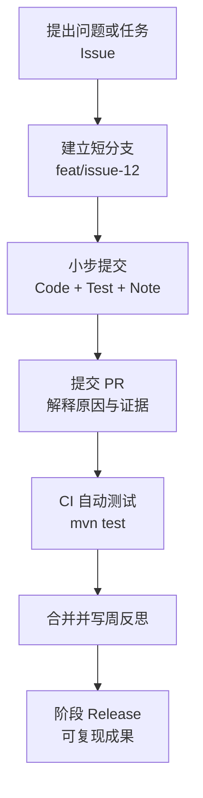

## 一、总体建议：采用“双轨三仓”，不要把所有内容塞进一个仓库

最适合这个学生的结构是：

|仓库|可见性|核心作用|
|---|---|---|
|`<username>/<username>`|Public|GitHub 个人主页与申请入口|
|`cs-learning-journal`|Public|CS 学习、思考、讨论、阶段成果的长期证据链|
|`dynamic-risk-aware-voxel-path`|**Private**|科研代码、实验数据、未公开方法与专利相关材料|
|`voxel-pathfinding-showcase`|以后再建|专利申请后，经审查可公开的科研展示版|

GitHub 会把与用户名同名仓库的 README 展示在个人主页，并支持置顶优秀仓库，因此不需要现在建立 GitHub Organization，也不建议制造大量零散仓库。[GitHub Profile README](https://docs.github.com/en/account-and-profile/how-tos/profile-customization/managing-your-profile-readme)、[Pinning repositories](https://docs.github.com/en/account-and-profile/how-tos/profile-customization/pinning-items-to-your-profile)

最重要的边界是：`dynamic-risk-aware-voxel-path` 暂时必须保持 Private。WIPO 明确提醒，申请前公开发明内容可能破坏新颖性，而各国宽限期并不一致；不能因为美国存在一定宽限期，就假设中国、欧洲或其他地区同样安全。[WIPO Patent FAQ](https://www.wipo.int/en/web/patents/faq_patents)、[WIPO Patent Protection Guidance](https://www.wipo.int/en/web/patents/protection)

这不是法律意见，公开任何算法创新、专利对比结果或关键实现之前，应由专利代理人确认。

---

## 二、GitHub 个人主页仓库

仓库名必须与 GitHub 用户名完全相同，例如账号为 `elias-student`，则仓库为：

```text
elias-student/elias-student
└── README.md
```

个人主页 README 建议以英文为主，控制在一屏半以内：

```markdown
# Hi, I'm ...

Grade 11 student interested in algorithms,
3D environments and reliable software experiments.

## Current Focus
- Data structures and graph algorithms
- Java 21, Maven and JUnit
- Dynamic path planning in mutable voxel environments

## Selected Work
- CS Learning Journal
- Algorithm Visual Labs
- Dynamic Risk-Aware Voxel Path Planning

## Current Research Question
How can a path planner balance distance, risk exposure
and replanning cost in a changing 3D voxel environment?

## Evidence
- Tested implementations
- Reproducible experiments
- Technical reflections
- Milestone releases
```

不建议堆满动态徽章、技能图标和贡献热力图。招生材料真正有价值的是：

- 一眼能看懂学生研究什么；
    
- 能进入精选仓库；
    
- 能看到具体成果和复现证据；
    
- 能区分学生原创、脚手架、导师建议和 AI 辅助。
    

---

## 三、公开学习仓库 `cs-learning-journal`

这个仓库不是课堂笔记仓库，而是“学习—思考—实践—反思”的公开证据索引。

```text
cs-learning-journal/
├── README.md
├── ROADMAP.md
├── LEARNING_POLICY.md
├── AI_USAGE.md
├── CONTRIBUTIONS.md
│
├── weekly/
│   ├── 2026/
│   │   ├── 2026-W36.md
│   │   ├── 2026-W37.md
│   │   └── 2026-W38.md
│   └── README.md
│
├── topics/
│   ├── data-structures/
│   │   ├── queue-stack-set-map.md
│   │   ├── priority-queue.md
│   │   └── hashing.md
│   ├── algorithms/
│   │   ├── bfs.md
│   │   ├── dijkstra.md
│   │   ├── astar.md
│   │   └── complexity.md
│   ├── java/
│   │   ├── collections.md
│   │   ├── records-and-immutability.md
│   │   └── testing-with-junit.md
│   ├── mathematics/
│   │   ├── graph-models.md
│   │   ├── three-dimensional-coordinates.md
│   │   └── probability-and-risk.md
│   └── research-methods/
│       ├── experimental-design.md
│       ├── reproducibility.md
│       └── reading-papers.md
│
├── reading-notes/
│   ├── courses/
│   │   ├── bro-code-java.md
│   │   └── cs61b.md
│   ├── papers/
│   │   ├── lifelong-planning-a-star.md
│   │   └── d-star-lite.md
│   └── README.md
│
├── labs/
│   ├── 01-voxel-indexing/
│   ├── 02-six-connected-neighbors/
│   ├── 03-bfs-tracer/
│   ├── 04-dijkstra-tracer/
│   ├── 05-astar-heuristics/
│   └── README.md
│
├── reflections/
│   ├── mistakes-and-debugging.md
│   ├── design-decisions.md
│   └── semester-review.md
│
├── evidence/
│   ├── skill-matrix.md
│   ├── milestone-index.md
│   ├── demos.md
│   └── presentations/
│
├── projects/
│   └── README.md
│
├── .github/
│   ├── ISSUE_TEMPLATE/
│   │   ├── learning-question.yml
│   │   ├── reading-note.yml
│   │   └── mini-lab.yml
│   └── PULL_REQUEST_TEMPLATE.md
│
└── assets/
    ├── diagrams/
    └── screenshots/
```

### 每周日志格式

每周只写一篇真实总结，不需要人为制造每日提交：

```markdown
# 2026-W36

## This Week's Goal
Understand how a voxel grid becomes a graph.

## Materials Studied
- CS 61B: Graph Traversals
- Red Blob Games: Grids and Graphs

## What I Can Explain Now
- A voxel can be treated as a graph vertex.
- Six-connected movement creates at most six edges.

## Evidence
- Lab 01: voxel indexing
- Issue #12: Why boundary voxels have fewer neighbors
- PR #15: Add six-neighbor tests

## Mistakes and Corrections
I originally checked blocked status before checking bounds,
which caused an array-index error.

## Remaining Question
How should unknown voxels differ from blocked voxels?

## Next Week
Implement and trace BFS and Dijkstra.
```

招生价值最高的是“错误—分析—修正”部分，它比连续展示正确答案更能证明真实学习过程。

---

## 四、科研仓库 `dynamic-risk-aware-voxel-path`

建议在不破坏现有 Java 21/Maven、`org.voxelpath` 包结构和33项基线测试的前提下，逐步整理成以下体系：

```text
dynamic-risk-aware-voxel-path/
├── README.md
├── pom.xml
├── CHANGELOG.md
├── AI_USAGE.md
├── CONTRIBUTIONS.md
├── SCAFFOLD_PROVENANCE.md
│
├── .github/
│   ├── workflows/
│   │   └── maven-ci.yml
│   ├── ISSUE_TEMPLATE/
│   │   ├── learning-question.yml
│   │   ├── feature.yml
│   │   ├── experiment.yml
│   │   └── bug.yml
│   └── PULL_REQUEST_TEMPLATE.md
│
├── docs/
│   ├── project-charter.md
│   ├── research-question.md
│   ├── terminology.md
│   │
│   ├── background/
│   │   ├── voxel-grids.md
│   │   ├── graph-search.md
│   │   └── incremental-planning.md
│   │
│   ├── model/
│   │   ├── movement-model.md
│   │   ├── dynamic-world-model.md
│   │   └── risk-objective.md
│   │
│   ├── architecture/
│   │   ├── package-structure.md
│   │   ├── planner-contract.md
│   │   └── experiment-pipeline.md
│   │
│   ├── decisions/
│   │   ├── ADR-0001-six-connected-default.md
│   │   ├── ADR-0002-pluggable-movement-model.md
│   │   ├── ADR-0003-risk-objective.md
│   │   └── ADR-0004-snapshot-tick-order.md
│   │
│   ├── research-log/
│   │   ├── 2026-09.md
│   │   └── 2026-10.md
│   │
│   └── reviews/
│       └── review-2026-09-xx.md
│
├── src/
│   ├── main/java/org/voxelpath/
│   │   ├── model/
│   │   ├── world/
│   │   ├── movement/
│   │   ├── cost/
│   │   ├── search/
│   │   │   ├── api/
│   │   │   ├── ds/
│   │   │   └── algorithms/
│   │   │       ├── DijkstraPlanner.java
│   │   │       ├── AStarPlanner.java
│   │   │       ├── WeightedAStarPlanner.java
│   │   │       ├── RepeatedAStarPlanner.java
│   │   │       ├── LpaStarPlanner.java
│   │   │       └── DStarLitePlanner.java
│   │   ├── scenario/
│   │   └── experiment/
│   │
│   └── test/java/org/voxelpath/
│       ├── model/
│       ├── world/
│       ├── movement/
│       ├── cost/
│       ├── search/
│       ├── contract/
│       └── regression/
│
├── experiments/
│   ├── README.md
│   ├── configs/
│   ├── scenarios/
│   ├── manifests/
│   ├── scripts/
│   └── analysis/
│
├── results/
│   ├── samples/
│   ├── raw/
│   ├── processed/
│   ├── figures/
│   └── reports/
│
├── benchmarks/
├── demo/
├── scripts/
├── .gitignore
└── .gitattributes
```

如果当前 `manifests/` 已在仓库根目录，暂时不要为了目录整洁立即搬迁。先保证33项测试和现有脚本通过，再通过独立 Issue 和 PR 完成迁移。

### 四个关键溯源文件

`SCAFFOLD_PROVENANCE.md`

- 哪些接口、测试和 TODO 是预先提供的；
    
- 初始 scaffold 的日期与版本；
    
- 学生从哪个 commit 开始独立工作；
    
- 六个 Planner 中哪些仍是占位实现。
    

`CONTRIBUTIONS.md`

- 学生完成的代码、实验和文档；
    
- 导师只提供了哪些建议；
    
- 哪些内容来自公开论文或课程；
    
- 哪些代码由他人审查。
    

`AI_USAGE.md`

- AI 用于解释、调试建议、代码审查还是生成草稿；
    
- 学生如何验证 AI 输出；
    
- 哪些核心算法要求由学生独立实现；
    
- 学生必须能解释每一行最终提交代码。
    

`docs/decisions/ADR-*`

- 记录为什么选择默认六连通；
    
- 为什么 MovementModel 保持可插拔；
    
- 为什么风险目标采用 J(P)=C(P)+λR(P)J(P)=C(P)+\lambda R(P)；
    
- 为什么 tick 顺序固定为“事件→快照→规划→移动→记录”。
    

这些文件能直接解决申请材料中的“项目究竟是不是学生自己完成”的可信度问题。

---

## 五、Issue、PR、讨论和实验如何形成证据链

推荐工作流：



GitHub 官方也将 Issues 定位为任务、Bug和想法跟踪，将 PR 定位为代码变更讨论与审查；Projects 适合把大任务拆成子任务并附加状态、里程碑等元数据。[GitHub Issues](https://docs.github.com/issues/tracking-your-work-with-issues/about-issues)、[Pull Requests](https://docs.github.com/articles/using-pull-requests)、[Projects best practices](https://docs.github.com/en/issues/planning-and-tracking-with-projects/learning-about-projects/best-practices-for-projects)

### 三类讨论分别放在哪里

|内容|推荐位置|
|---|---|
|“为什么 A* 的 h=0 等价于 Dijkstra？”|Public Learning Discussions|
|“实现 PriorityQueue 时出现 stale entry”|Research Issue|
|“是否调整 snapshot 接口”|Research Issue + ADR|
|某段实现的具体修改意见|Pull Request comments|
|一个月后的综合认识|Weekly log / reflection|
|导师反馈与学生回应|`docs/reviews/` 的学生总结|

不要原样上传聊天记录。应该由学生重新组织成：

1. 我原来的理解；
    
2. 对方提出了什么质疑；
    
3. 我用什么例子或代码验证；
    
4. 我的结论是否改变；
    
5. 还存在哪些不确定性。
    

---

## 六、Commit、分支和版本规范

### 分支

```text
main
feat/issue-12-voxel-index
test/issue-18-boundary-cases
experiment/issue-31-lambda-sweep
docs/issue-35-risk-definition
fix/issue-42-stale-priority-entry
```

### Commit

```text
feat: add six-connected neighbor generation
test: cover corner and blocked-neighbor cases
docs: explain x-fastest flat indexing
experiment: add lambda sensitivity configuration
fix: discard stale priority queue entries
refactor: isolate movement model from voxel grid
```

不要为了 contribution graph 每天提交空文件，也不要回填或伪造历史。已有工作可以用一个明确的初始提交导入：

```text
chore: import provided research scaffold

- Java 21 / Maven baseline
- org.voxelpath package
- six planner TODO slots
- 33 baseline tests passing
- student implementation begins after this commit
```

随后打标签：

```text
scaffold-v0.1
```

### 阶段 Release

建议采用真实功能里程碑，而不是按周发布：

|Release|可验收成果|
|---|---|
|`v0.1-static-grid`|体素、邻域、Dijkstra 基线|
|`v0.2-heuristic-search`|A*、Weighted A*、启发式验证|
|`v0.3-dynamic-world`|event、snapshot、version、Repeated A*|
|`v0.4-risk-aware`|J=C+λRJ=C+\lambda R 与敏感性实验|
|`v0.5-incremental`|LPA*、D* Lite|
|`v1.0-research-prototype`|六算法对比、复现实验包和技术报告|

GitHub Actions 可以在每次 PR 自动运行 Maven 构建和测试，让“33项基线始终通过”成为可见证据。[GitHub Java with Maven CI](https://docs.github.com/actions/guides/building-and-testing-java-with-maven)

---

## 七、申请材料中的证据映射

|申请主张|GitHub 证据|
|---|---|
|掌握数据结构与算法|topic note + 手推记录 + lab + tests|
|具备独立编程能力|Issue → commits → PR → CI|
|能进行科研思考|research question + ADR + reading note|
|能设计公平实验|config + manifest + raw data + analysis|
|能识别和修正错误|bug issue + failing test + fix PR|
|能清晰表达技术问题|英文 README + reflection + demo|
|项目为长期真实投入|周志、里程碑、Release、演进历史|
|工作由学生主导|provenance + contributions + AI usage|
|结果可以复现|commit hash + seed + manifest + command|

科研仓库公开后，可增加 `CITATION.cff`；GitHub支持通过该文件提供机器可读的引用信息，也可以在最终研究成果稳定后通过 Zenodo 生成 DOI。[GitHub CITATION.cff](https://docs.github.com/en/repositories/managing-your-repositorys-settings-and-features/customizing-your-repository/about-citation-files)、[GitHub and Zenodo DOI](https://docs.github.com/repositories/archiving-a-github-repository/referencing-and-citing-content)

---

## 八、必须遵守的边界

- 不在专利申请前公开核心算法、关键实验和可实施细节。
    
- 不把 Git commit 时间戳宣传为专利优先权或法律上的发明证明。
    
- 不上传专利权利要求草稿、身份证明、学校内部资料或导师隐私信息。
    
- 不上传仍在进行中的竞赛或课程受保护答案。
    
- 不由家长或导师登录学生账号代写提交；审查者应使用独立账号评论。
    
- 不提交 API Key、密码、访问令牌、私人邮箱或绝对路径。
    
- 不让 AI 直接填满提交历史；每个成果必须由学生理解、验证和答辩。
    
- 不追求仓库数量、star 数或绿色贡献格，重点是少而完整、证据闭环。
    

现阶段最合理的启动顺序是：先建立个人主页和 `cs-learning-journal` 公共仓库，同时将已有科研 scaffold 导入 Private 的 `dynamic-risk-aware-voxel-path`，标记 `scaffold-v0.1` 并记录来源；待专利策略明确后，再决定科研项目的公开范围。